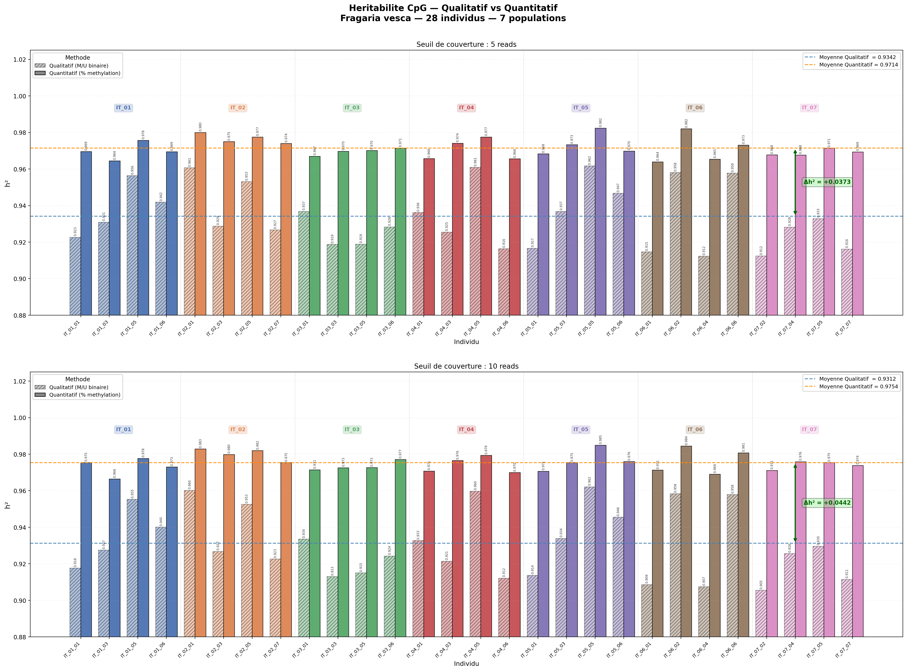
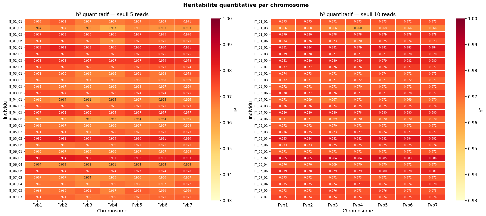
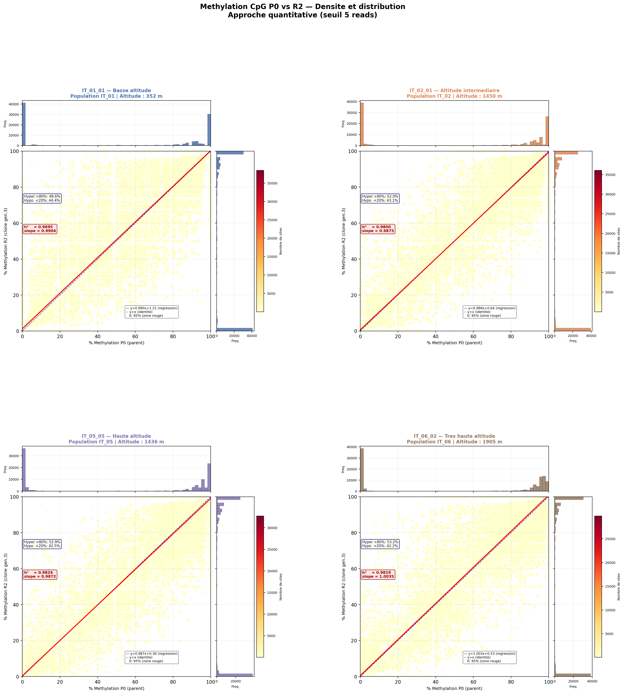
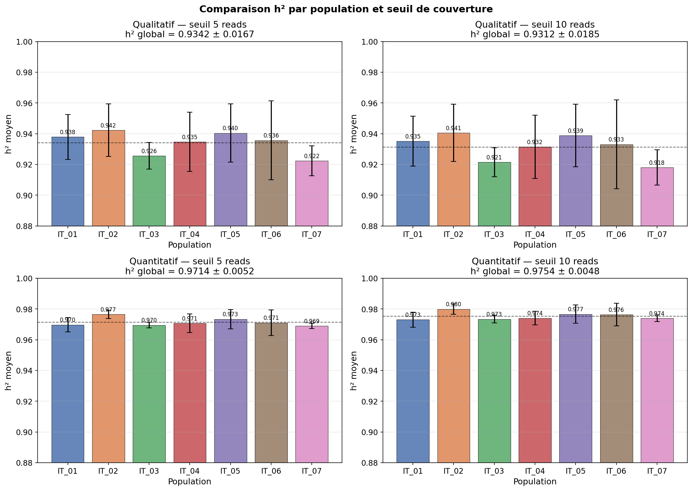
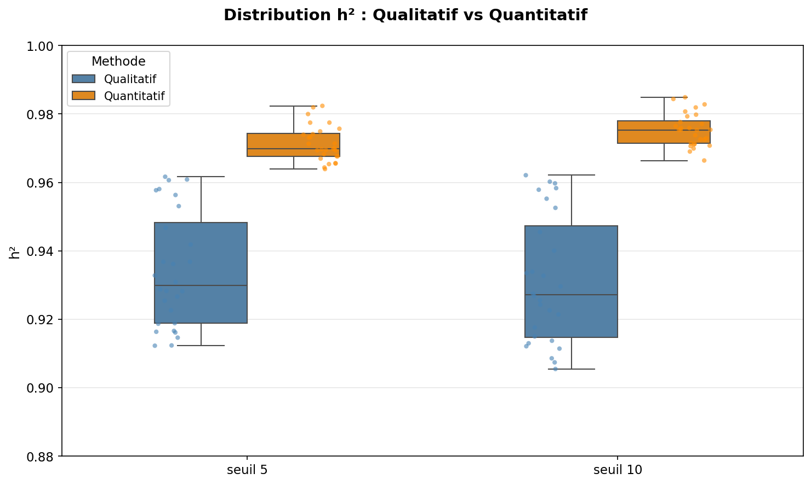
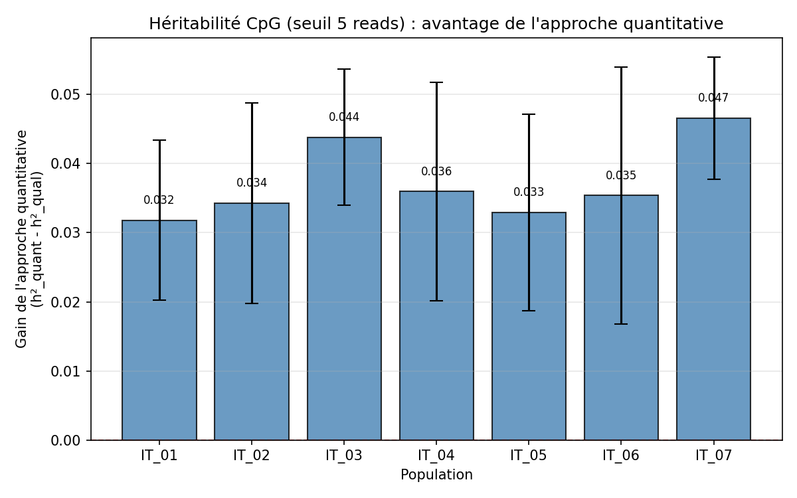
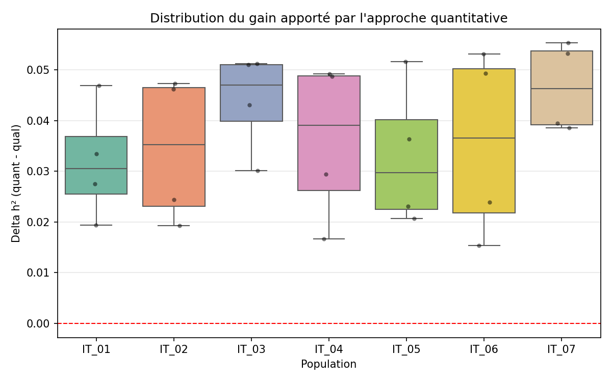
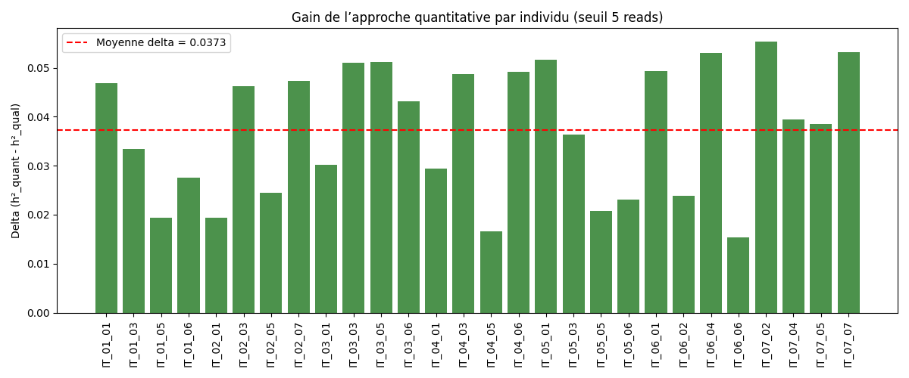

# Methylation Heritability — *Fragaria vesca*

**Estimation of CpG / CHG / CHH methylation heritability in woodland strawberry — Qualitative vs Quantitative approach**

[](./LICENSE)
[](https://www.python.org)
[](https://en.wikipedia.org/wiki/Bisulfite_sequencing)
[](https://pandas.pydata.org)
[](https://matplotlib.org)
[](https://www.univ-perp.fr)

*Stage M1 CHPS · Université de Perpignan Via Domitia · 2025–2026*

---

## Biological context

*Fragaria vesca* (woodland strawberry) is a diploid model plant widely used in epigenetic studies.
This project analyzes **whole-genome bisulfite sequencing (WGBS)** data from clonal lineages
to quantify how faithfully cytosine methylation patterns are transmitted across clonal generations,
across three sequence contexts: **CpG**, **CHG**, and **CHH**.

Two clonal generations are compared for each of **28 parent–clone pairs** (7 populations × 4 individuals):

| Generation | Description |
|------------|-------------|
| P0 | Parental generation |
| R2 | 3rd-generation clonal daughter |

---

## Scientific question

> *Is cytosine methylation a heritable epigenetic mark in clonal plants, and does the estimation method (qualitative vs quantitative) affect the heritability measure?*

| Approach | Description | Estimator |
|----------|-------------|-----------|
| **Qualitative** | Methylation status binarized at a context-specific threshold | Pearson r² on binary vectors |
| **Quantitative** | Raw methylation percentages (0–100) retained | Pearson r² on continuous values |

---

## Repository structure

```
methylation-heritability-fvesca/
│
├── README.md                        <- this file
├── LICENSE
├── Makefile
├── requirements.txt
├── .gitignore
│
├── CpG/                             <- CpG context (complete)
│   ├── README.md
│   ├── scripts/
│   │   ├── 01_intersection_CpG.py
│   │   ├── 02_filtrage_couverture.py
│   │   ├── 03A_heritabilite_qualitative.py
│   │   ├── 03B_heritabilite_quantitative.py
│   │   ├── 04_visualisation.py
│   │   └── 05_comparaison_delta.py
│   ├── results/
│   │   ├── figures/
│   │   ├── heritabilite/
│   │   ├── filtrage/
│   │   └── individual_information.csv
│   └── data/                        <- .bedGraph.gz (gitignored)
│
├── CHG/                             <- CHG context (in progress)
│   ├── scripts/
│   ├── results/
│   └── data/
│
├── CHH/                             <- CHH context (in progress)
│   ├── scripts/
│   ├── results/
│   └── data/
│
└── Annotation_genome_F_Vesca/       <- genome annotation files
```

---

## Results summary (CpG context, coverage >= 5 reads)

| Approach | Mean h² ± SD | Note |
|----------|-------------|------|
| **Quantitative** | **0.9714 ± 0.004** | Near-total heritability, stable across individuals |
| Qualitative | 0.9342 ± 0.017 | Underestimates by ~3.7%, 4x more variable |

Key findings:

- CpG methylation is highly heritable (h² > 0.93) across all 28 clonal pairs
- The quantitative approach is systematically more precise than the qualitative one
- High-altitude populations (IT_06, IT_07) show larger gain from quantitative approach (+0.047)
- Heritability is genome-wide: h² > 0.95 on every chromosome (Fvb1–Fvb7)

Results for CHG and CHH contexts will be added as analyses are completed.

---

## Figures (CpG)

### h² qualitative vs quantitative per individual



### Heritability heatmap by chromosome



### Methylation scatter P0 vs R2



### h² per population



### Distribution comparison (boxplot)



### Delta h² per population







---

## Installation

```bash
git clone https://github.com/CodingYayaToure/methylation-heritability-fvesca.git
cd methylation-heritability-fvesca

python3 -m venv venv
source venv/bin/activate

pip install -r requirements.txt
```

Raw `.bedGraph.gz` data files are not versioned. Place them in `CpG/data/` before running.

## Usage

```bash
cd CpG
make all
```

See [CpG/README.md](CpG/README.md) for the full pipeline description.

---

## License

MIT License — see [LICENSE](./LICENSE) for details.

*M1 CHPS · Université de Perpignan Via Domitia · 2025–2026*
